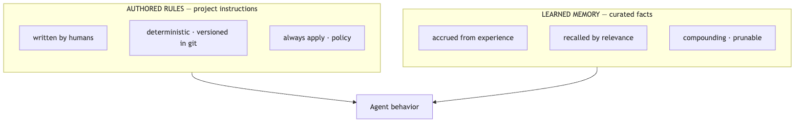
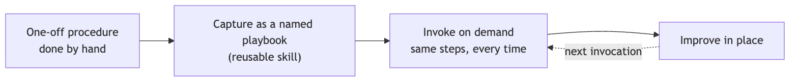

<!--
SPEAKER NOTES → PPTX presenter notes.
The authored-rules layer of the operating model. Knowledge-share framing.
Through-line: you don't train an AI engineer, you write down how you work where it reads it.
Authored rules (policy) + reusable playbooks (procedure), distinct from learned memory.
-->

# The Repo Is the Onboarding Doc

### Authored rules + reusable playbooks

*You don't train an AI engineer — you write down how you work.*

---

## The instinct vs the lever

- Faced with an agent that doesn't work the way the team does, the instinct is **a better model / a cleverer prompt.**
- The bigger lever is mundane: **write your conventions down where the agent reads them — every time.**

> A new agent is only as good as the manual you hand it. The repo *is* that manual.

<!--
Reframe AI enablement away from model-shopping toward something the team fully controls: what
they write down. This lands well with a CTO who's tired of "we need a better model" asks.
-->

---

## Two sources of behavior

**Authored rules** (policy you write) and **learned memory** (facts it accrues). Both shape behavior — governed differently.

<!--
Diagram A. The whole talk hinges on keeping these two apart. Rules are written and deterministic;
memory is learned and situational.
-->

---

## Authored rules — the constitution

A project-instructions file the agent reads on **every task**:

- **Deterministic** — same input, same policy.
- **Versioned in git** — reviewed like code.
- **Always applied** — not recalled by chance.

<!--
"Constitution" is the right register: it's the standing law of the repo, not a suggestion and
not a fact. It applies every time, by construction.
-->

---

## What goes in rules

- Conventions, guardrails, where-things-live
- Do / don't, the verification bar, the coordination protocol

> **Policy — not facts.**
> "Always branch in a worktree" is a **rule**. "This module has quirk X" is a **memory**.

<!--
The example is the clearest way to teach the rules-vs-memory split. Repeat it; it's the crux.
-->

---

## Rules vs memory — when to use which

- **Stable policy** → rules.
- **Situational learned fact** → memory.

Getting this split right is what keeps **both** clean.

*(Callback: the Tiered Agent Memory deck.)*

<!--
Tie back to the memory deck explicitly — together they cover the full picture of what shapes
an agent's behavior.
-->

---

## Reusable playbooks

A procedure done **once by hand** → captured as a **named, invocable playbook** → run the **same steps every time** → improved in place.

<!--
Diagram B. Playbooks are the procedural complement to rules: rules say what's allowed;
playbooks encode how a recurring job is done.
-->

---

## Why playbooks

- **Repeatability** — same steps, every run.
- **No re-deriving** the procedure each time.
- The **procedure itself** is reviewed and versioned — not just its output.

> Abstract examples: an intake/triage routine, a release checklist, a debugging protocol.

<!--
The subtle win: you get to version *how the work is done*, not only what it produced. That's
process-as-code.
-->

---

## The compounding effect

With rules + playbooks, a **fresh agent or session is onboarded instantly** —

it **reads the manual** and the playbooks instead of relearning the shop.

<!--
This is the ROI line for a CTO: zero-ramp onboarding for every new agent or session, because
the knowledge is in the repo, not in someone's head.
-->

---

## What it buys

- **Consistent behavior**
- **Instant onboarding**
- **Policy-as-code**

> *Honest caveat:* rules rot too. An over-long or stale rulebook gets **ignored** or **contradicts itself** — curate and prune it like any living doc.

<!--
Value, then the honest failure mode: a bloated rules file is worse than a short one, because
agents (and humans) stop reading it.
-->

---

## Close

### "You don't onboard an AI engineer with training. You onboard it with *writing* — and you keep the writing honest."

<!--
The takeaway: enablement is a writing-and-curation discipline, fully in the team's control.
-->
