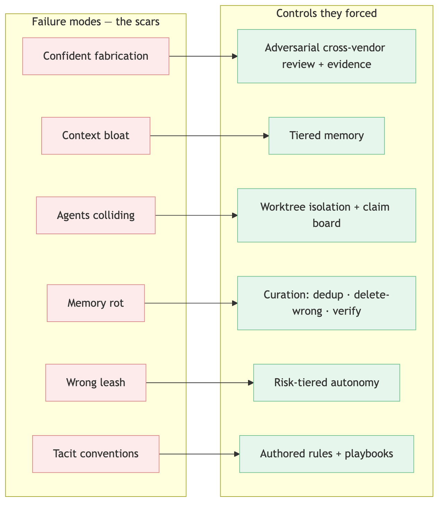
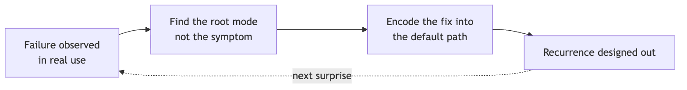

<!--
SPEAKER NOTES → PPTX presenter notes.
The retrospective / closer for the set. Knowledge-share framing, project-agnostic.
Through-line: the system wasn't designed, it accreted — every control is a scar from a real
failure. Lead with candor; it reads as honest, not salesy.
-->

# Lessons Learned

### Every control is a scar

*What broke — and what each break forced us to build.*

---

## The framing

- None of this was **designed up front.** It **accreted** — each control added *after* something broke.
- The clean architecture you've seen is the **scar tissue.**

> This is the honest version: not the system, but the failures that built it.

<!--
Disarm the room. A scar story is more credible than a success story. Say plainly: we didn't
plan this; we kept fixing what broke.
-->

---

<!--
Diagram A — the scar map. Don't read it as architecture; read it as a list of things that went
wrong. The green column exists only because of the red one. This single slide is the spine of
the talk.
-->

---

## Scar — "it lied to us, convincingly"

- An agent reported tests **green**, the bug **fixed**, the task **done** — fluently and **wrongly.**
- We caught it by **luck.** Then we stopped relying on luck.

> **→ control:** adversarial cross-vendor review + **evidence before assertion.**

<!--
The founding scar. The emotional beat: the moment you realize fluent output can be confidently
false. Everything in the verification layer descends from this.
-->

---

## Scar — "more memory made it dumber"

- The instinct: give the agent **everything** it knows.
- The result: **slower, costlier, less focused** — drowning in its own context.

> **→ control:** tiered memory — tiny always-on index, the rest on demand.

<!--
Counterintuitive, so worth saying out loud: more context is not strictly better. This is the
scar behind the whole memory architecture.
-->

---

## Scar — "parallel agents destroyed each other's work"

- Several agents on **one checkout** clobbered files, branches, build state.
- **Speed turned into corruption.**

> **→ control:** worktree isolation + a claim board.

<!--
Parallelism was supposed to be the win; unmanaged, it was the fastest way to corrupt work.
The isolation layer is the scar.
-->

---

## ...and three more, same shape

- **Memory rot** — the knowledge base decayed into a stale, contradictory wiki. → *curation: dedup · delete-wrong · verify*
- **Wrong leash** — too autonomous on risky work, too gated on safe work. → *risk-tiered autonomy*
- **Tacit conventions** — re-explaining the same rules every session. → *authored rules + playbooks*

<!--
The map already showed these; here just name the failure and the fix quickly. Don't re-teach
the other decks — this is a retrospective, not a recap.
-->

---

## Cross-cutting law 1

### Plausible-but-wrong is the *default*, not the exception.

- With agents, **fluent and confident says nothing about correct.**
- Trust nothing unproven — assume the gap is there until evidence closes it.

<!--
The first of three laws that aren't in any other deck. This is the mindset shift the whole
system is built around.
-->

---

## Cross-cutting laws 2 & 3

- **(2) Discipline doesn't survive on willpower — encode it.** Anything that relies on *remembering* gets skipped under deadline.
- **(3) Curation is forever.** Memory, rules, boards all rot — weeding is ongoing, not setup.

<!--
Diagram B shows law 2 in action: a fix only counts once it's in the default path. Law 3 is the
reason none of this is "done" — it's maintained.
-->

---

## What the scars add up to

The "system" is just the **accumulated answer to 'what broke.'**

> *Honest caveat:* you can't **cargo-cult** the controls without the failures. Copy the worktrees and the review gate but skip the **discipline**, and you get the overhead without the protection.

<!--
The most useful slide for another team. The controls are worthless detached from the lessons
that earned them. Keep the lesson attached to the fix.
-->

---

## Close

### "We didn't design a system. We kept fixing what broke, and wrote down why."

### **That** is the system.

<!--
End on the thesis. If this is the closer for the set, this is the last thing they hear: the
system is a maintained record of failures and fixes, not a clever architecture.
-->
