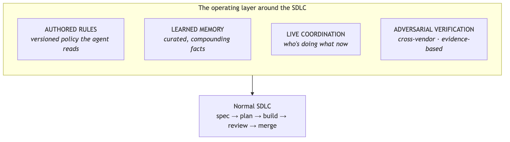
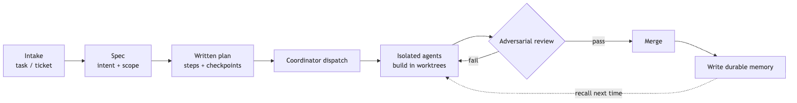

<!--
SPEAKER NOTES in HTML comments → export to PPTX presenter notes.
This is the CAPSTONE / index deck — opener or closer for the set of five.
Through-line: AI-assisted engineering is a thin operating layer (rules, memory, coordination,
verification) around an unchanged SDLC. Each layer is its own companion talk.
-->

# How We Run AI-Assisted Engineering

### The operating model

*The map the other talks slot into.*

---

## The trap

- "Use AI to code" sounds like **one tool** — a model, a clever prompt.
- Run it at **team scale** and that breaks: collisions, forgotten context, unreviewed output, no consistency.

> What actually works is an **operating model** — a small set of layers around how you already ship.

<!--
Don't oversell a tool; sell a system. The CTO has seen "AI coding tool" demos. The pitch is
that the demo isn't the hard part — running it as an operation is.
-->

---

<!--
Diagram A. The SDLC in the middle is unchanged — spec, plan, build, review, merge. The four
layers wrap it. The point of the slide: we didn't reinvent software delivery; we wrapped it.
-->

---

## The loop in motion

Intake → spec → plan → dispatch → **isolated build** → **adversarial review** → merge → **write memory** → recall feeds the next task.

<!--
Trace one task end to end. Nothing exotic in the steps; the layers just make each step safe
for an autonomous agent.
-->

---

## The four layers — each its own talk

- **Authored rules** — the versioned constitution the agent reads every time. → *The Repo Is the Onboarding Doc*
- **Learned memory** — curated, tiered facts that compound. → *Tiered Agent Memory*
- **Live coordination** — many agents in parallel, no collision. → *The Virtual Engineering Team*
- **Adversarial verification** — cross-vendor review + evidence. → *Trust, but Verify*

<!--
This slide is the table of contents for the whole set. Name each layer, name its talk, move on.
-->

---

## Wrapped in governance

Autonomy is **risk-tiered**, not all-or-nothing:

- cheap, reversible work runs **autonomously** to a PR
- expensive or irreversible work hits a **human gate**

→ companion: *How Much Leash?*

<!--
The governance ring sits outside all four layers. It decides how much an agent may do before
it has to ask. This is the slide a risk-conscious CTO leans into.
-->

---

## What it buys

The SDLC stays familiar to every engineer — the **layers** do the work:

- **Trustworthy** (verification)
- **Parallel** (coordination)
- **Consistent** (rules)
- **Compounding** (memory)

> *Honest caveat:* the operating layer is real overhead. It earns its keep **at scale**, not on a one-off script.

<!--
End on value, then the honest cost. The caveat keeps the knowledge-share credible.
-->

---

## Close

### "Not one tool — a thin operating system around how you already ship software."

Five short talks, one system. This was the map.

<!--
If this is the opener, end with "let's walk each layer." If the closer, end with "that's the
whole system." Either way: it's a system, not a gadget.
-->
