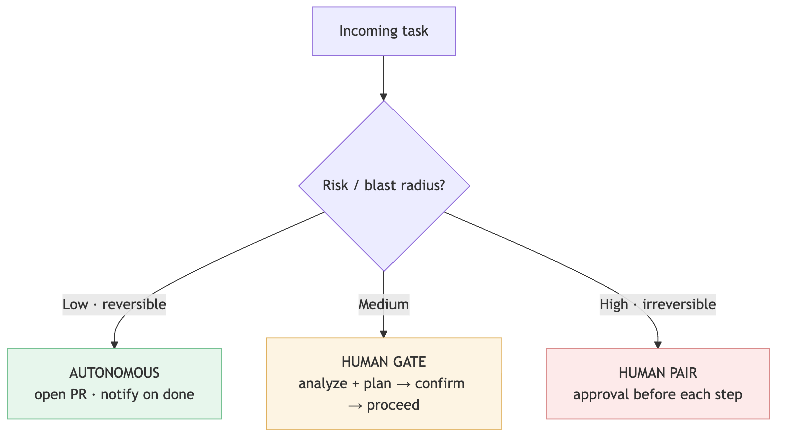
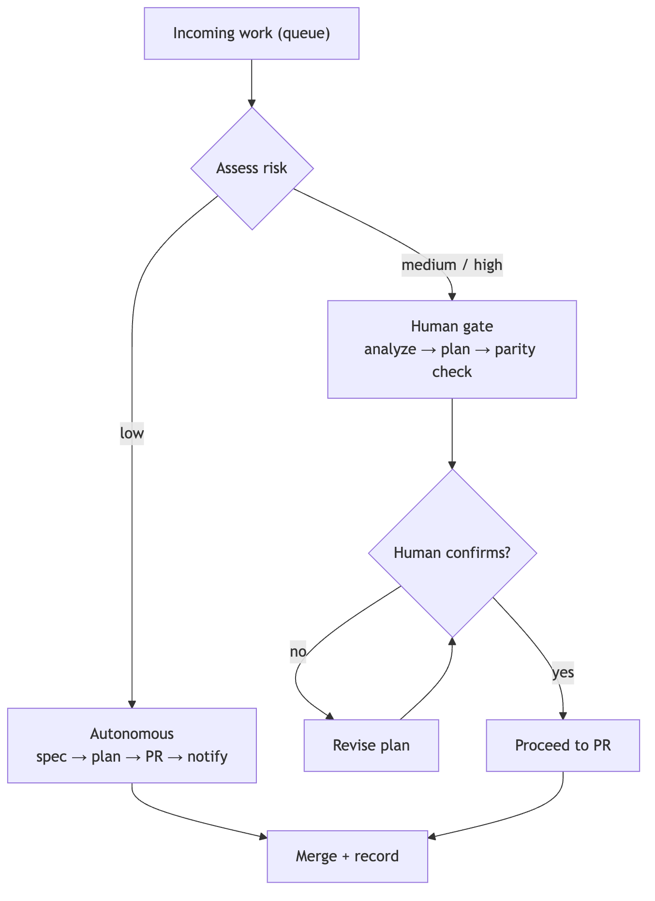

<!--
SPEAKER NOTES → PPTX presenter notes.
The governance ring of the operating model. Knowledge-share framing.
Through-line: autonomy is per-task, routed by blast radius × reversibility — not a global on/off.
Autonomous still means "to a PR, not to prod."
-->

# How Much Leash?

### Risk-tiered autonomy

*Match the leash to the blast radius.*

---

## The false binary

- The usual debate: **"let agents run free"** vs **"approve everything."**
- One is **reckless.** The other **throws away the speed** that made agents worth using.

> The way out: stop treating autonomy as a global switch. Make it a **per-task routing decision.**

<!--
Every CTO has heard this binary. Dismantling it in the first 60 seconds earns the room.
-->

---

## The axis that matters

Not *"how hard is the task?"* — but:

### "How bad if it's wrong, and can we undo it?"

**Blast radius × reversibility.**

- Hard task, tiny blast radius → safe to automate.
- Trivial task, irreversible → **not.**

<!--
This reframing is the core idea. Difficulty is the wrong axis; consequence-of-error and
reversibility are the right ones. Drive this home before showing the spectrum.
-->

---

<!--
Diagram A — the spectrum. Green: low + reversible runs autonomously. Amber: medium hits a
human gate. Red: high + irreversible gets a human pair. The traffic-light coloring does the
talking.
-->

---

<!--
Diagram B — routing in practice. Incoming work is risk-assessed, then low goes
spec→plan→PR→notify, while medium/high goes analyze→plan→human-confirm before proceeding.
-->

---

## The gate is lightweight

- A human confirms the **plan and direction** — not every keystroke.
- Approve the **approach**, then let the agent execute.

> Heavy gates get rubber-stamped or bypassed. A cheap gate is a gate that actually gets used.

<!--
The failure mode of gating is making it so heavy people route around it. Confirm direction,
not detail.
-->

---

## The autonomous lane is still safe

- "Autonomous" means **to a PR — not to prod.**
- Review and **revert** still apply. A human is **notified.**

> Autonomy ≠ unsupervised merge to main.

<!--
This single clarification defuses most of the fear. Autonomous agents aren't pushing to
production; they're opening pull requests like any engineer.
-->

---

## Re-tier dynamically

- A task that **surprises** — touches more than expected, fails a check — **escalates** to a gate.
- **Downgrade trust on anomaly;** don't ride the original tier blindly.

<!--
Tiers are assigned up front but not frozen. The moment reality diverges from the estimate,
the leash shortens automatically.
-->

---

## This is your world already

Risk-tiered autonomy is just **change-management / blast-radius policy** — applied to agents.

The same instinct behind *"who's allowed to approve a prod migration?"*

<!--
Anchor it in something the CTO already does for humans. You're not inventing governance;
you're extending it to a new kind of worker.
-->

---

## What it buys

**Speed where it's safe. Control where it counts.**

> *Honest caveat:* the risk is **mis-tiering.** Err toward the gate when unsure, and keep the reversibility assessment honest — the cost of undo is easy to underestimate.

<!--
Value, then the honest failure mode. Mis-tiering is the whole risk; conservatism on the
reversibility call is the mitigation.
-->

---

## Close

### "Don't ask 'should agents be autonomous?' Ask 'how much leash for *this* task?'"

<!--
The reframe, one more time, as the takeaway line.
-->
