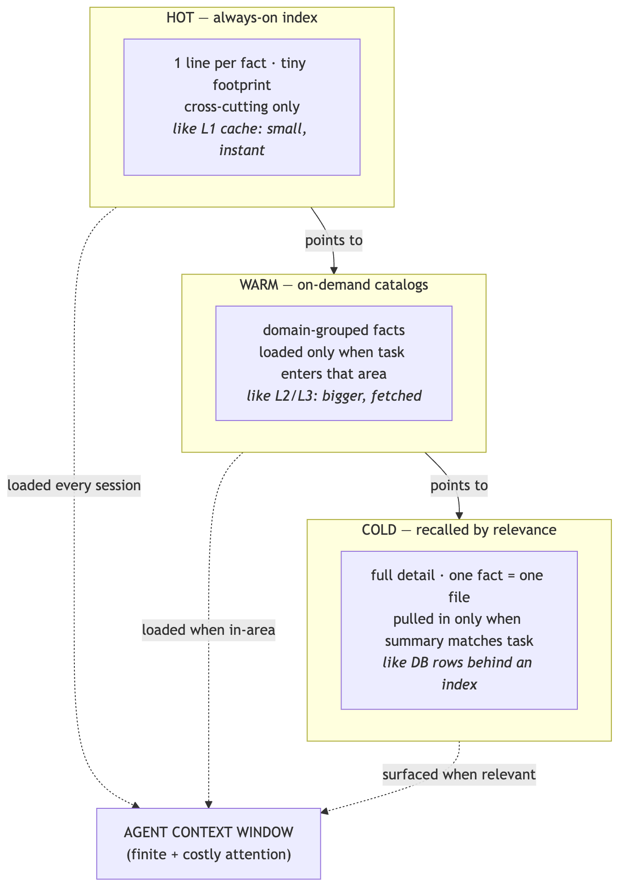
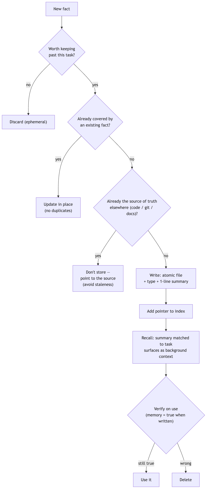

<!--
SPEAKER NOTES live in these HTML comments and export into PPTX presenter notes.
This deck is framed as a knowledge-share — "a pattern we landed on," not a pitch.
Through-line: agents have amnesia + a finite, costly attention budget; tier memory
like a CPU cache and curate it so it never rots.
-->

# Tiered Agent Memory

### Giving AI coding agents an institutional memory

*A context-engineering pattern we landed on.*

---

## The two problems

- AI agents are **amnesiac** — every session starts from zero, so the same constraints, preferences, and past mistakes get re-explained endlessly.
- Context is **finite and metered** — you *can't* paste everything you know into every session: it's expensive, slow, and dilutes the model's attention on the actual task.

> The tension: more knowledge available, but loading more makes the agent **worse and costlier**.

<!--
Open on the tension, not the files. Every CTO feels this: AI tools that forget,
and the cost/latency of stuffing context. Name both problems before any solution.
-->

---

## The insight

The same problem **hardware solved decades ago**: you can't keep everything fast and close — so you **tier** it.

`small / hot / always-on`  →  `larger / warm / on-demand`  →  `large / cold / fetched-when-relevant`

<!--
Land the cache analogy here. It lets a technical leader assess soundness in seconds,
and it carries the rest of the talk.
-->

---

<!--
Diagram A — the memory hierarchy. Walk top to bottom: the HOT index is loaded every
session and is tiny; WARM catalogs load only in-area; COLD facts surface only when their
one-line summary matches the task. Only the relevant slice ever reaches the context window.
-->

---

## Pillar 1 — Atomic, typed facts

- **One fact = one file.** Atomicity makes facts easy to update, delete, and dedupe — no giant doc nobody maintains.
- Each fact is **typed**: who-the-user-is · feedback/corrections (*with the why*) · ongoing-work context · external references.
- Type drives **policy**: how long a fact lives, how aggressively it's recalled.

<!--
The atomic unit is the whole trick for maintainability. Typing is what lets recall and
retention be policy-driven instead of one undifferentiated blob.
-->

---

## Pillar 2 — Tiered loading *(the cost optimization)*

- **Hot index** — one line per fact, always loaded. Just enough to know a fact exists and when it's relevant. Deliberately tiny, cross-cutting only.
- **Warm catalogs** — domain-grouped, loaded only when the task enters that domain.
- **Cold recall** — full detail pulled in for a single fact only when its summary matches.

> This is where the **token + attention savings** come from.

<!--
This is the slide that answers "why not just load everything?" The always-on footprint
stays flat as the knowledge base grows. Cost scales with relevance, not with size.
-->

---

## Pillar 3 — Relevance-based recall

- Each fact carries a one-line **description written for matching**, not for humans.
- The system surfaces **only relevant facts**...
- ...and surfaces them as **background context, not commands** — so old notes can't hijack new work.

<!--
The "context not commands" detail matters: a recalled fact informs, it doesn't override
the current task. That's what keeps a growing memory from causing drift.
-->

---

## Pillar 4 — Curation discipline *(why it doesn't rot)*

The failure mode of every knowledge base is **staleness**. Four rules prevent it:

- **Dedup** — update the existing fact, never add a near-duplicate.
- **Delete-on-wrong** — a disproven fact is removed, not buried.
- **Single source of truth** — don't store what code/git/docs already record; point to it.
- **Verify-on-use + absolute dates** — a memory reflects what was true *when written*; confirm before acting, never store "yesterday."

<!--
Be honest here: this discipline is ongoing work. That candor is what makes a knowledge-share
credible. The rules are the product — the files are just where they're written down.
-->

---

<!--
Diagram B — the fact lifecycle. Note the three gates before anything is written
(worth-keeping? already-covered? already-a-source-of-truth?) and the verify-on-use gate
that ends in either "use it" or "delete." This flow is the curation discipline made concrete.
-->

---

## Pillar 5 — Separate durable vs ephemeral

- Long-lived knowledge and live "who's-doing-what-now" coordination have **different lifetimes and different rules**.
- Mixing them is how knowledge bases fill with **noise**. Keep two channels.

<!--
Durable memory is curated and compounding; the ephemeral board is disposable live state.
Keeping them apart is what keeps the durable store clean.
-->

---

## What changes in practice

- **Knowledge compounds** — a correction is captured once, applied every future session.
- **Lower context cost** — always-on footprint stays tiny vs. dumping everything.
- **More consistent behavior** — fewer repeated mistakes, less re-explaining.
- **Trustworthy over time** — curation prevents the stale-wiki death spiral.

> *Honest caveat:* it only works **with** the discipline. The rules are the product, not the files.

<!--
Outcomes, stated plainly and honestly. Resist over-claiming — the caveat earns trust.
-->

---

## Why it generalizes

- Nothing here is tool-specific. It's **caching, database indexing, lazy-loading, and good onboarding docs** — applied to an agent's working memory.
- Transferable to **any agentic AI workflow, any team**.

### "Here's the pattern — happy to go deeper on the mechanics."

<!--
Close open, no ask. Knowledge-share goal: leave them with the mental model and an offer,
not a decision to make.
-->
