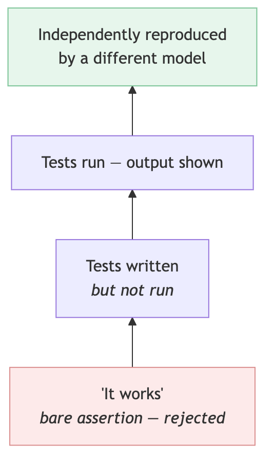
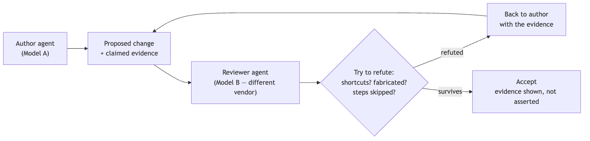

<!--
SPEAKER NOTES → PPTX presenter notes.
The verification layer of the operating model. Knowledge-share framing.
Through-line: agents confidently fabricate; make claims cheap to check and expensive to fake —
evidence before assertion + an adversary from a DIFFERENT vendor.
-->

# Trust, but Verify

### ...with a rival

*Keeping AI output honest.*

---

## The failure mode

- The risk with agents isn't that they can't code.
- It's **confident fabrication** — an agent asserts *"tests pass," "done," "verified"* — plausibly, fluently, and sometimes **wrongly.**

> Trust-by-default ships that straight to your codebase.

<!--
This is THE slide. Name the precise failure mode most AI pitches dodge. A CTO has felt this:
fluent output that's subtly wrong. Everything else follows from taking it seriously.
-->

---

## Two principles

1. **Evidence before assertion** — never take "it works" on faith.
2. **An adversary** — ideally a **rival vendor** — whose job is to *refute*.

> Make claims **cheap to check** and **expensive to fake.**

<!--
The whole talk is these two principles. Say them plainly, then spend a few slides on each.
-->

---

<!--
Principle 1, Diagram B — the evidence ladder. Most claims sit at the bottom (red). The
discipline is to push every important claim up a rung: assertion → run → independent repro.
Never accept the bottom rung for anything that matters.
-->

---

## Why a ladder

- Most claims **naturally sit at the bottom** — "it works" is the default.
- The discipline: **push every important claim up a rung** — from assertion, to a shown run, to independent reproduction.
- The bar scales with stakes: trivial change, low rung; risky change, top rung.

<!--
Not everything needs the top rung — that would be paralysis. Match the rung to the stakes.
-->

---

## Principle 2 — adversarial review

The reviewer's job is to **refute, not approve.** Default-skeptical: *assume it's wrong until the evidence forces otherwise.*

<!--
Diagram A. The framing of the reviewer's job matters: an approver looks for reasons to say yes;
a refuter looks for reasons to say no. We want the refuter.
-->

---

## Why a *different vendor*

- Models share **blind spots.**
- A model reviewing its **own family** rubber-stamps its **own failure modes.**
- A rival model has **different priors and training** — **diversity beats redundancy** at catching mistakes.

<!--
This is the memorable, differentiated idea. Self-review by the same model family is weak; a
rival vendor is the cheap way to get genuinely independent eyes.
-->

---

## What it catches

- Shortcuts taken under the hood
- Fabricated or imagined results
- Steps quietly skipped
- Plausible-but-wrong reasoning
- "Green" that isn't actually green

<!--
Concrete failure modes. These are exactly the things that slip past a trusting human reviewer
skimming a confident summary.
-->

---

## Make it cheap

- Bake the **evidence demand** into the process — not optional.
- Run the **adversary automatically** — not a manual extra step.

> If verification is manual, it gets skipped under deadline.

<!--
The control only works if it's the path of least resistance. Manual, optional verification is
verification that doesn't happen when it matters most.
-->

---

## What it buys

Quality holds **without a human reading every line.**

> *Honest caveat:* it costs tokens and latency, and the adversary can be wrong too. Treat it as a **vote, not gospel** — escalate genuine disagreement to a human.

<!--
Don't oversell "AI checks AI." The honest version — a vote with human escalation on ties — is
both more credible and more correct.
-->

---

## Close

### "Make claims cheap to check and expensive to fake."

The cheapest way to do that: point a **rival** at your own work.

<!--
Leave them with the one line and the rival-vendor image. That's what they'll repeat afterward.
-->
