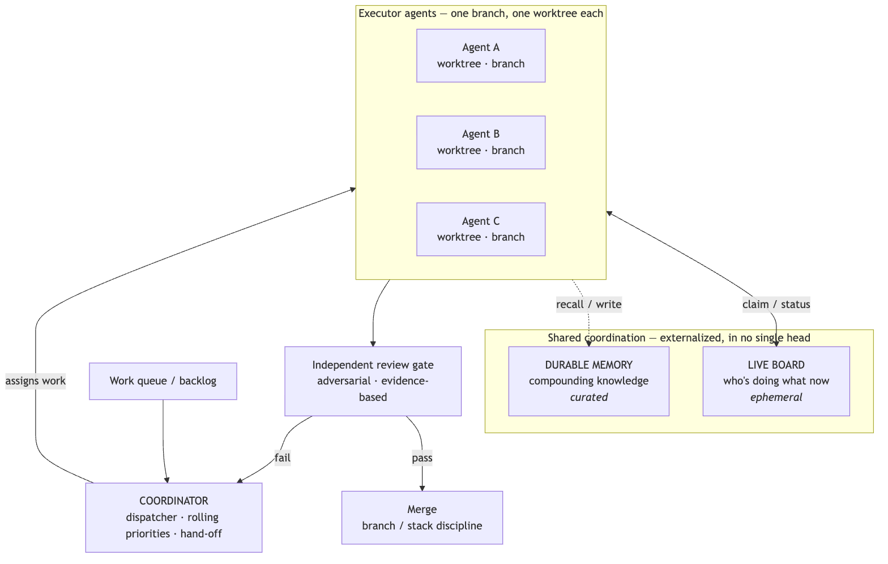
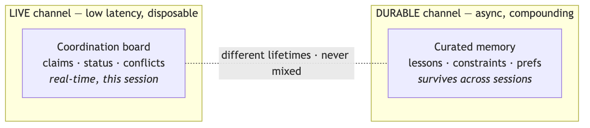
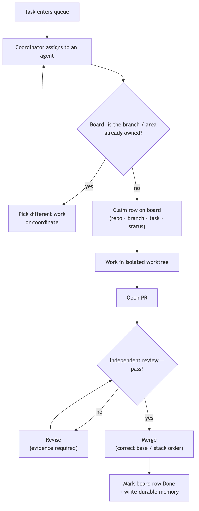

<!--
SPEAKER NOTES live in these HTML comments and export into PPTX presenter notes.
Knowledge-share framing — "a pattern we landed on," not a pitch.
Through-line: N agents on one codebase = a distributed eng team, but stateless and prone to
confident fabrication. Port the org chart + SDLC onto agents; encode rules where they read them.
Companion to the "Tiered Agent Memory" deck (the durable-knowledge channel).
-->

# The Virtual Engineering Team

### Running AI coding agents in parallel on one codebase

*A coordination pattern we landed on.*

---

## The problem

- One agent, one task, serial — wastes the thing that makes agents valuable: **you can run many at once.**
- Point several at the same codebase and they **collide**: two editing the same files, one clobbering another's branch, work duplicated, nothing reviewed, context lost.

> The question isn't "can an agent code?" It's **"how do you run a *team* of them without chaos?"**

<!--
Open on the chaos. Every CTO recognizes these failure modes from human teams: merge conflicts,
lost work, unreviewed code. That recognition is the hook.
-->

---

## The reframe

- N parallel agents face the **same problems a human engineering org already solved** — branching, code review, stand-ups, a tech lead, release hygiene.
- So don't invent new coordination tech. **Port the org chart and the SDLC onto agents** — and encode the rules where agents actually read them: repo, memory, a shared board.

<!--
This is the spine of the whole talk. We're not building novel infrastructure; we're adapting
40 years of how humans ship software, plus two AI-specific twists (revealed later).
-->

---

<!--
Diagram A — the topology. Walk it: work queue → coordinator assigns → isolated executors
(one worktree each) → they share a live board + durable memory → independent review gate →
merge on pass, loop back to the coordinator on fail.
-->

---

## Pillar 1 — Isolation: one branch, one workspace

- Every agent works in its **own git worktree** — never the shared checkout.
- The equivalent of feature branches + a private dev sandbox per engineer.
- Kills the *physical* collisions: file clobbering, shared build state, stash collisions.

<!--
Isolation is the floor. Without it, nothing else matters — two agents in one working directory
will corrupt each other regardless of how good the coordination is.
-->

---

## Pillar 2 — Externalized coordination *(two channels)*

- Agents are **stateless** — nothing lives "in their head." Coordination must be **written down.**
- **Live board** *(ephemeral)* — who's doing what right now: claims, status, conflicts.
- **Durable memory** *(curated)* — lessons and constraints that compound across sessions.

<!--
The two channels have different lifetimes, so they stay separate. The durable channel is the
subject of the companion "Tiered Agent Memory" deck — call that back here.
-->

---

## Pillar 3 — The coordinator / dispatcher

- One agent plays **tech-lead / PM**: owns the work queue, assigns tasks, keeps a **rolling priority list**, runs hand-off.
- Executors stay focused; priorities stay coherent; **nobody double-grabs** a task.

<!--
The coordinator is what keeps N agents from each independently deciding "I'll do the most
important thing" and all grabbing the same one.
-->

---

## Pillar 4 — The claim protocol *(rules of engagement)*

Before starting, every agent:

- **Reads the board** — if someone owns the branch/area, pick different work or coordinate.
- **Claims** its row — repo · branch · task · status.
- **Marks done** when finished — releasing the claim.

> Optimistic concurrency control for agents — lightweight advisory locks, not heavy gatekeeping.

<!--
Keep it lightweight. If the protocol is heavy, agents (and humans) route around it. The whole
value is that it's cheap enough to always follow.
-->

---

<!--
Diagram B — one task's life across the fleet. Note the ownership gate before any work, the
review pass/fail loop, and the close-out: clear the board row AND write the durable memory.
-->

---

## Pillar 5 — Adversarial, evidence-based review

- An agent can **confidently claim** something works when it doesn't.
- So review is **adversarial** — a different model or a fresh agent tries to *refute* the work.
- ...and **evidence-based** — show the passing run, not an assertion.

> Code review + CI, adapted to the failure mode that's unique to agents.

<!--
This is the single most important AI-specific control. Plausible-but-wrong output is the
default risk; an adversarial, evidence-demanding reviewer is the antidote.
-->

---

## Merge discipline

The boring release hygiene a human team needs — encoded so agents follow it:

- Branch off the **right base**.
- Correct **stacked-PR order** (don't orphan a stacked branch).
- **No force-push** after a PR merges.
- A **real build / bundle check** before merge — lint + unit tests miss integration breaks.

<!--
Unglamorous but essential. These are the rules that, skipped, produce a green PR that breaks
main. Encode them; don't assume them.
-->

---

## The two twists that make it *not* a human team

- **Stateless** → coordination must be **externalized** (no memory, no hallway chat).
- **Confident fabrication** → verification must be **adversarial + evidence-based** (no trust).

Everything else is **borrowed** from how humans already ship software.

<!--
This slide is the intellectual payoff. It tells the CTO exactly which two things you can't
copy-paste from human process, and why.
-->

---

## What changes in practice

- **Real parallelism** without collision.
- **No lost or clobbered work** (isolation).
- **Coherent priorities**, no duplicated effort (coordinator + board).
- **Quality holds at speed** (adversarial review).
- **Knowledge compounds** across the whole fleet (durable memory).

> *Honest caveat:* coordination has overhead. It pays off only above a certain parallelism, and only if the protocol stays lightweight and the defaults are baked into the repo.

<!--
Outcomes, then the honest cost. The caveat is what makes a knowledge-share credible.
-->

---

## Why it generalizes

- It's an **org chart and an SDLC adapted for agents** — feature branches, a tech lead, code review, CI, a stand-up board.
- Portable to **any team running more than one AI engineer at a time**.

### "An org chart for robots — happy to go deeper on the mechanics."

<!--
Close open, no ask. Pair this with the memory deck to show one coherent system, not two gadgets.
-->
